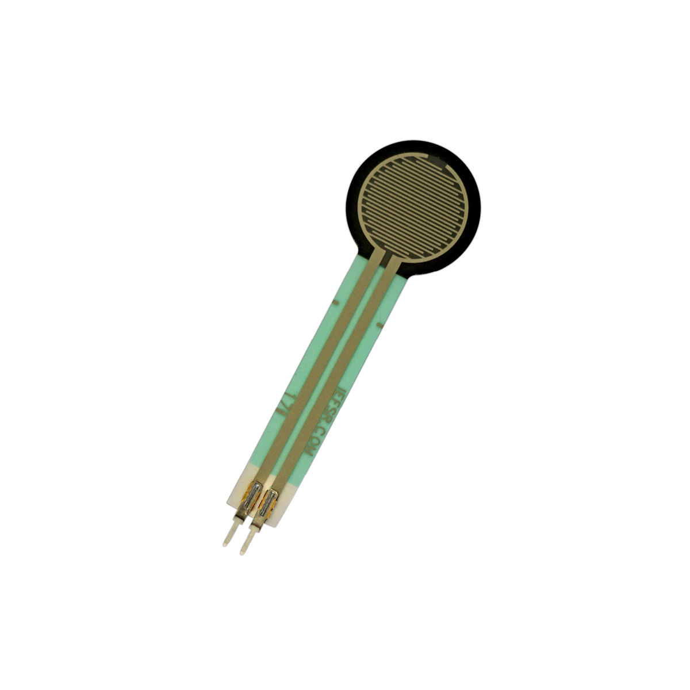

---
title: "Drucksensor"
date: "2018-10-01T13:54:33.000Z"
tags: 
  - "sensor"
coverImage: "31_drucksensor.jpg"
material_number: "31"
material_type: "sensor"
manufacture: "Generic"
repo_name: "mks-generic-Force_Sensitive_Resistor"
repo_prefix: "mks"
repo_manufacture: "generic"
repo_part: "Force_Sensitive_Resistor"
product_url: "https://learn.adafruit.com/force-sensitive-resistor-fsr/using-an-fsr"
clone_url: "https://github.com/Make-Your-School/mks-generic-Force_Sensitive_Resistor.git"
embedded_example_file: "examples/Force_Sensitive_Resistor_minimal/Force_Sensitive_Resistor_minimal.ino"
---

# Drucksensor

## Beschreibung
Der Drucksensor ermöglicht es, Kräfte, die auf den Sensor wirken, zu bestimmen. Wird die Sensorfläche belastet, ändert sich der elektrische Widerstand zwischen den Anschlusspins. Durch eine Widerstandsmessung, kann folglich auf den einwirkenden Druck (also Kraft pro Flächeneinheit) geschlossen werden.

Da ein Arduino nicht direkt eine Widerstandsänderung messen kann, wird eine Messverstärkerschaltung benötigt. Eine Möglichkeit bietet hierfür ein sogenannter Spannungsteiler, bei dem der Sensor in Reihe mit einem zweiten Widerstand zwischen Versorgungsspannung und Masse gelegt wird. Der Arduino kann schließlich die Widerstandsänderung als Spannungsänderung über einen analogen Pin erfassen.

Der Sensor kann genutzt werden, um eine Berührung eines Objekts zu erkennen. Zusätzlich lässt sich die tatsächliche Kraft, die auf das Objekt ausgeübt wird, ermitteln.

Alle weiteren Hintergrundinformationen sowie ein Beispielaufbau sind im Datenblatt des Sensors zusammengefasst. Zusätzlich findet man über alle gängigen Suchmaschinen durch die Eingabe der genauen Komponentenbezeichnungen entsprechende Projektbeispiele und Tutorials. Hierbei ist das wichtige Stichwort „FSR“ (force sensing resistor).

<!-- infolist -->

<!-- infolists -->
## Wichtige Links für die ersten Schritte:

- FSR Drucksensor [overview](https://www.sparkfun.com/datasheets/Sensors/Pressure/fsrguide.pdf)  

## Projektbeispiele:

- [Adafruit - FSR Sensoren](https://learn.adafruit.com/force-sensitive-resistor-fsr/using-an-fsr)
- [Instructables - FSR Tutorial](https://www.instructables.com/id/FSR-Tutorial/)

## Weiterführende Hintergrundinformationen:

- [Spannungsteiler - Wikipedia Artikel](https://de.wikipedia.org/wiki/Spannungsteiler)
- [Messverstärker - Wikipedia Artikel](https://de.wikipedia.org/wiki/Messverst%C3%A4rker)
- [Force Sensing Resistor - Wikipedia Artikel](https://de.wikipedia.org/wiki/Force_Sensing_Resistor)
- [GPIO - Wikipedia Artikel](https://de.wikipedia.org/wiki/Allzweckeingabe/-ausgabe)
- [GitHub-Repository: Drucksensor](https://github.com/MakeYourSchool/31-Drucksensor)

